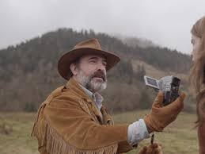

I am a neuroscientist interested in the effect of neuromodulators on sensory perception. Currently my main focus are psychedelics, in vivo recordings with high-density probes (Neuropixel) and neural decoding. 

